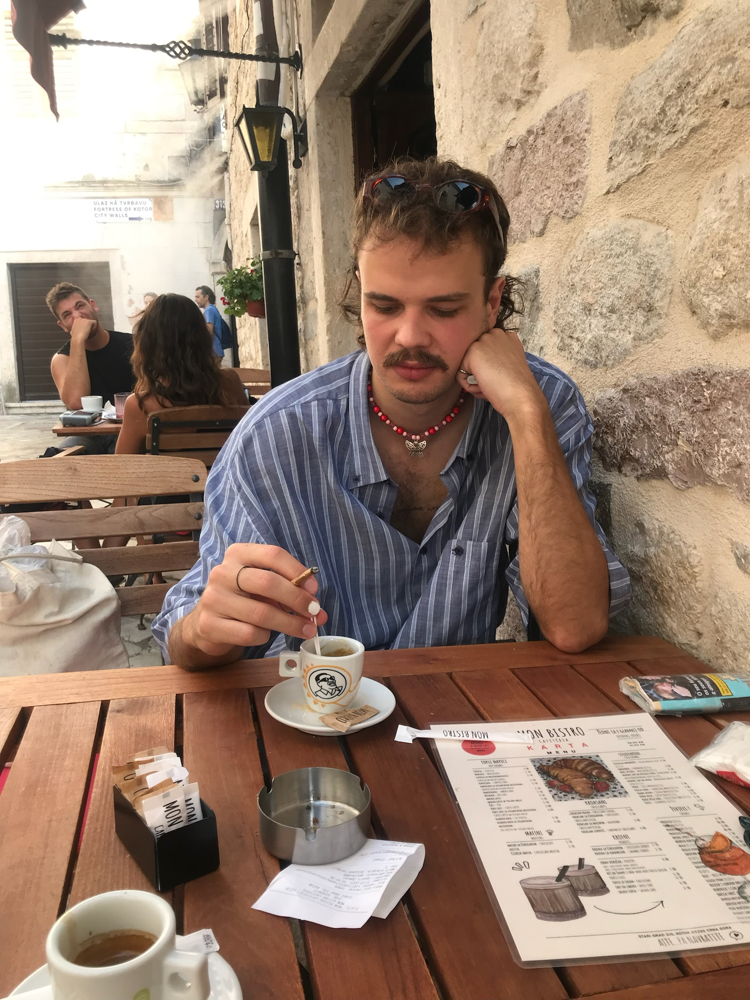
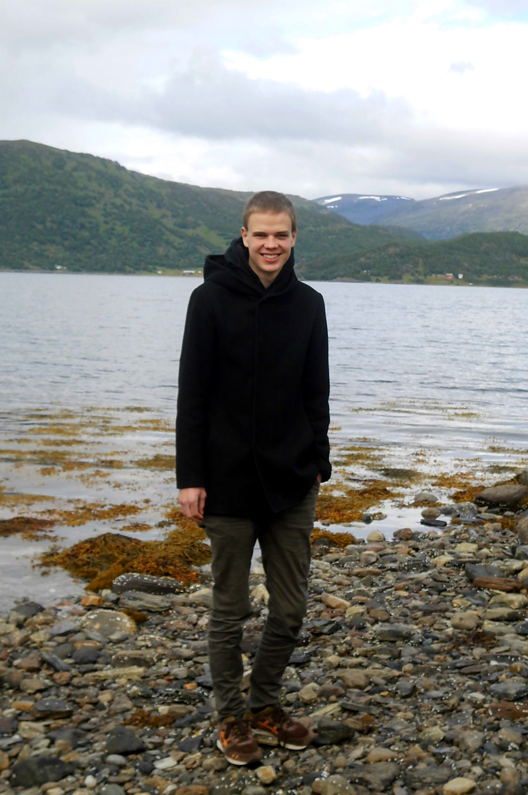
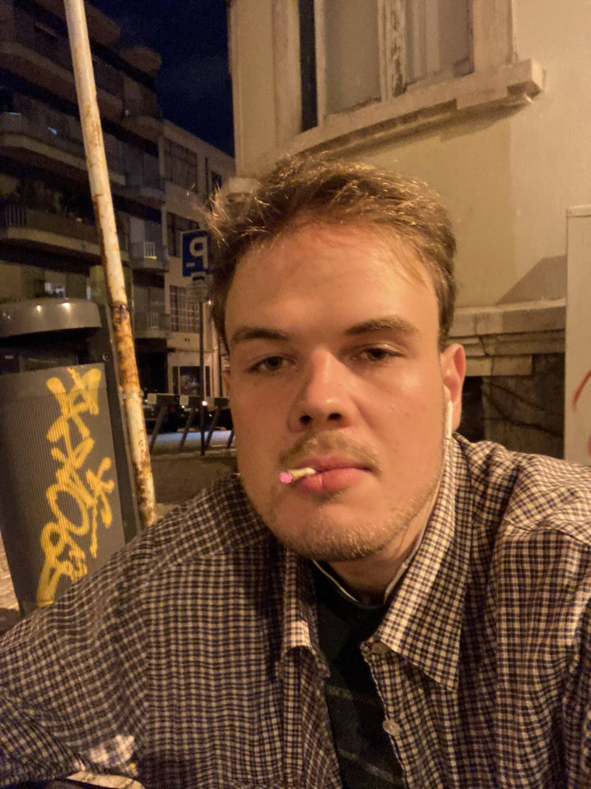
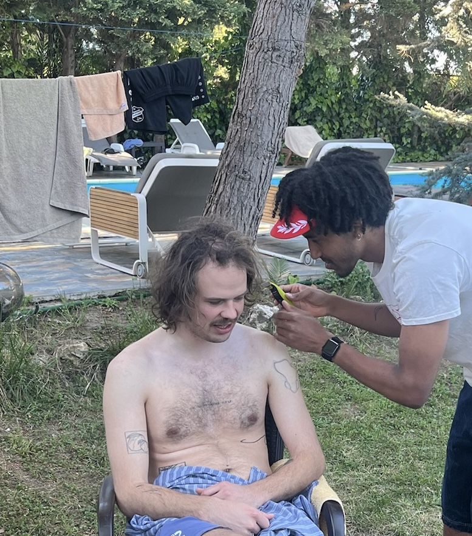
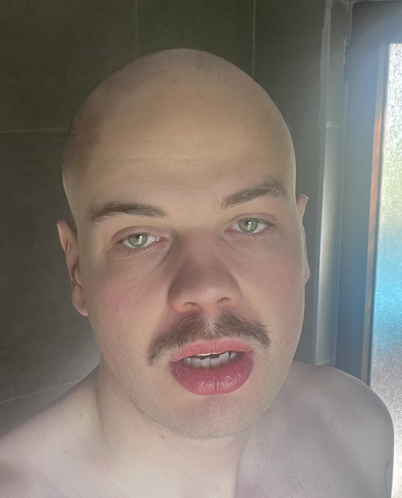

a few days before i first travelled to albania, i went to get a haircut. once it was done, the hairdresser showed me the back of my head in his mirror and i realised that my hair was thinning. as it is for many people i think, this realisation was really threatening to my identity and it became even more so later, in ways that i didn’t even know about at that point. 

i started growing my hair out at around 15 years old. i was lucky that it was a bit wavy and i thought it looked quite cool and so did the girl i was in love with at the time, which was enough of a reason to keep it. it was not a thing a lot of other boys in my school did, so it was a bit of a differentiating factor, which i think i also enjoyed, though it could also be tough sometimes. in combination with my relatively thin stature, people would make fun of me as girly, which i didn’t like at the time, but am somewhat happy about today in a weird way.

the first time i cut my hair off after growing them out was at 19 years old. it was somewhat of a drastic action. i was at a friend’s birthday and came home drunk. my roommate was going to shave his hair short and i just decided to do the same, without really putting much thought into it. the next day, i ended up in an accident that i also think about in some way as a suicide attempt. i got lucky and survived, though with a bruised face and a broken foot. it feels to me as though the act of cutting off the hair was a subconscious goodbye, a precursor to the actual one i was going to try less than 24 hours later, but that i had no idea of yet. i grew the hair out again right after this, but since then having short hair has always been connected to this very low moment in my life. i have one photo from this time, taken almost two months later and one can still see the black eye i got that night.

fast-forward another few years, now i’m 23. i just moved to portugal without speaking portuguese.  i need a shave and there's no mirror in the bathroom of the appartment i'm living in. i decide to go to a barber for the first time in my life and if i'm already there i might as well get a haircut. the barber i end up at does not speak a word of english. i try to use my hands to signal him that i want the hair cut at around chin length. i'm not sure if he misinterpreted my signs or if he just doesn't know how to cut hair to that length, but he  gives me a bog standard short men's cut. i have to fight the tears as i'm leaving the barber shop. i remember talking to my brother a few days later, describing my emotions to him as just feeling so terribly _normal_. it would take weeks, maybe even months to feel even somewhat comfortable again with my hair.

a few months after the albania trip i was talking about in the beginning, i realised that i was non-binary. with that realisation came some more understanding for all these complicated feelings i had had about my hair. the people that were calling me girly in school for it, had a point when they called me girly, and actually i liked being called girly. i understood why it was such a problem for me to be normal, because i am not and i don’t really want to be. with this understanding, though, also came an increase in the stakes of my hair loss. it was this one feature i still had that gave my appearance a little bit of androgyny. 

around my 26th birthday, it settled in that the thinning hair was not just thinning but there would have to be a point where it would have to go. it was one of the darkest times of my life, not only but also because of this. i felt as though what had been a subconscious decision to signify the end of my life before was now a process that was hoisted upon me from outside. i was dying. though this feeling became less intense throughout the years, it always stayed with me in some ways. whenever i looked into a mirror, the first thing i did was check how my hair looked. i started neurotically focussing on other people’s hair and trying to see if theirs was thinning as well. i became more and more insecure about my appearance.

the ad algorithms figured out the pain that i was in pretty quickly. they started trying to sell me all kinds of things to deal with my problem: weird hippie herb bullshit that probably doesn’t do anything. little pricking tools to stimulate the blood flow in your scalp. all kinds of pills, creams and ointments. and obviously hair transplants. i caved and went on topical finasteride about half a year ago, probably two years too late. i’m not sure if topical finasteride even works, especially with the long hair i still had on the top of my head, but at least it felt like i was doing something. i would do a hair transplant if i could afford one, but i can’t.

if the finasteride did anything, then it was certainly not enough because my obsessive checking in the mirror revealed to me that the hair kept falling out and i would inevitably have to do something about it. i had been dreading that moment for years, but i could feel it inching closer. now i’m in albania again with a few friends and as it happens, we take some photos of each other. yesterday, i saw one of those photos and it felt to me like the time might have actually come. 

throughout the day, i was contemplating the decision. if i wanted to do it and how to go about it. in the evening, we had a few drinks and we played some pool. i decided to make a show of it and bet my hair on a game of pool. usually, i’m a decent pool player, but by that point i was so drunk, i could barely hold the cue. i played in a team with my best friend and although he tried his hardest, he couldn’t save me from my inability. it came as it had to, we lost and i sat down to have my hair shaved down to zero. everyone was having a great time and in the photos even i am smiling.

now i woke up today not only hungover, but also bald. suddenly, my head is really cold. i wear a hoodie, but the stubble gets stuck in the fleece like velcro. when i look into the mirror, i see a stranger. i dread coming back and having to explain myself to everyone. but i don’t regret my decision. i knew it had to happen at some point. maybe i could’ve done it in a bit of a different way. maybe i could’ve waited a few more months. i would’ve liked to try out some weird hairstyles first, like a skullet for example, but i’m not even sure if i could’ve really pulled it off anyways.

now, it feels like i’m faced with becoming a new person in some way. i have to confront my vanity, which is clearly challenged by the new facts i have established about myself. i have to find other ways to express my feelings about gender and identity. i know many others must have dealt with this situation before. i hope to make this exciting, maybe buy some new clothes and take this idea seriously, that something ought to change. maybe i’ll try and learn the lesson and _actually_ get weird in my appearance. it is certainly possible the way i look right now. i’m still sad, but i’m not hopeless.

i ripped off the bandaid and now i will decorate the scar that was beneath it.

